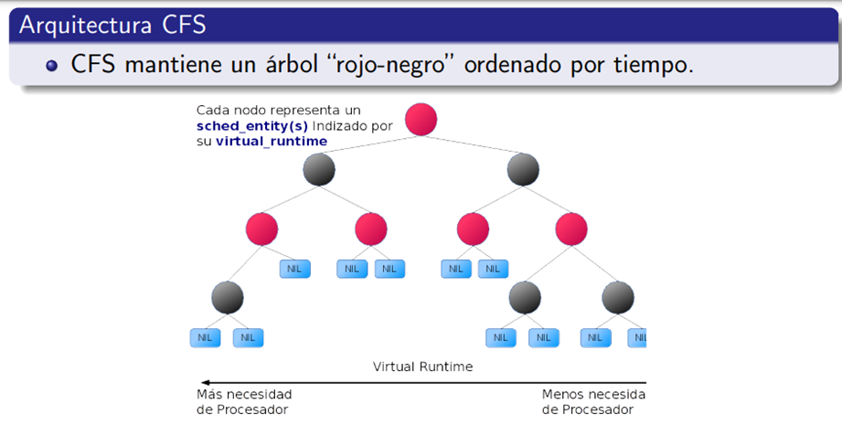

## Completely Fair Scheduler (CFS)

## Principales características y funcionamiento del CFS:

- **Equidad en la asignación de CPU:** El CFS busca proporcionar a cada proceso un tiempo de CPU justo y equitativo. No favorece a ningún proceso sobre otro, tratando de mantener un equilibrio entre todos los procesos en ejecución.

- **Modelo de procesador "ideal":** El diseño del CFS se basa en un modelo de procesador multitarea "ideal", donde todos los procesos tienen acceso a la CPU de manera justa y sin privilegios.

- **Virtual Runtime:** Para determinar qué proceso debe ejecutarse a continuación, el CFS utiliza un concepto llamado "Virtual Runtime". Este es un tiempo virtual que representa cuánto tiempo de CPU se ha asignado a cada proceso. El proceso con el menor tiempo virtual es seleccionado para ejecutarse a continuación.

- **Colas basadas en el tiempo:** El CFS organiza los procesos en colas basadas en el tiempo, priorizando aquellos procesos que han recibido menos tiempo de CPU en comparación con otros.

- **Tolerante a cambios de carga:** El CFS está diseñado para ser tolerante a cambios de carga en el sistema. A medida que cambian las cargas de trabajo, ajusta dinámicamente la asignación de CPU para garantizar una distribución equitativa del tiempo de CPU entre los procesos.

Desde la versión 2.6.23, el planificador tradicional de Linux fue reemplazado por el CFS. El 80% del diseño de CFS fundamentalmente modela un procesador multitarea "ideal". CFS busca mantener el equilibrio (equidad) en el tiempo de procesador que se asignan a los procesos. Es el componente del sistema operativo encargado de la planificación. La necesidad de algoritmos de planificación surgió con la aparición de sistemas operativos multitareas.

- Cada proceso debe recibir un tiempo equitativo. Cuando un proceso está "fuera de balance", se le asigna tiempo de ejecución en el procesador.
- Para determinar el balance, CFS mantiene la cantidad de tiempo que se le ha asignado a un proceso en lo que llaman "Virtual Runtime".
- Completely Fair Scheduler (CFS) utiliza colas basadas en el tiempo.
- El proceso con menor "Virtual Runtime" es el más próximo a ser ejecutado.

## Arquitectura de CFS

- Un árbol RB está balanceado El sub árbol con claves menores a n se encuentra a la izquierda. El sub árbol con claves mayores a n se encuentra a la derecha. La profundidad de 2 nodos cualquiera no difiere en más de 1. Los sub árboles son balanceados también. La búsqueda es O(log n). 
El nodo más a la izquierda tiene la clave más pequeña. Eso quiere decir que es el nodo con el menor “virtual runtime”. Es decir, es el nodo que representa al proceso que más necesita ejecutarse El nodo de más a la derecha tiene la clave más grande (mayor virtual runtime). Es el proceso que menos necesita ejecución.

- Entonces, CFS selecciona el nodo más a la izquierda para ser despachado. El nodo se elimina del árbol. Si no ha terminado, se inserta de nuevo con un nuevo valor de virtual runtime.
Políticas de Planificación Utiliza una técnica de tiempo compartido. A cada proceso se le asigna un quantum de tiempo para ejecutarse en el procesador.
La planificación se ejecuta acorde a un ranking de prioridad. Utiliza prioridades dinámicas que son ajustadas a través del tiempo. Los procesos que no han sido ejecutados por ele procesador en un periodo largo de tiempo, aumentan su prioridad. Los que han sido ejecutados por mayor tiempo, reducen su prioridad.

-  Prioridad Estática Estática: Es asignada cuando el proceso es creado. Los procesos de tiempo real también tienen prioridad estática (de 0 a 99). Estos procesos tienen prioridad mayor a los procesos comunes y no puede ser cambiada por el planificador. Estos utilizan 2 tipos de políticas: SCHED_FIFO SCHED_RR Los procesos normales utilizan la política SCHED_OTHER.

## Planificación de CPU

Se pueden clasificar los procesos mediante dos esquemas: CPU-bound y I/O-bound Interactive, Batch y Real-Time El planificador asigna mayor prioridad a procesos en tiempo real. Estos nunca pueden ser bloqueados por procesos de menor prioridad. Los procesos “Batch” son penalizados por el planificador, ya que no son responsivos y corren generalmente en segundo plano. Los procesos “Real Time” necesitan mayor tiempo de ejecución

