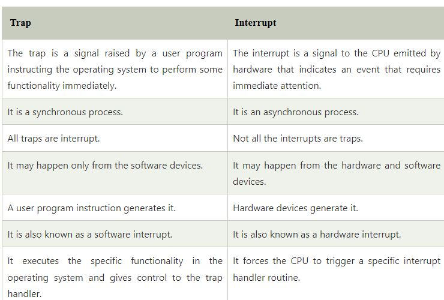

# Investigación: Conceptos de Sistemas Operativos

## Tipos de Kernel y sus Diferencias

**Núcleo (Kernel):** 
El Kernel, o núcleo, se refiere al software que relaciona las aplicaciones con el hardware de nuestro ordenador. Las órdenes del Kernel son las únicas que interactúan directamente con los componentes físicos del ordenador, como el procesador, la RAM o los discos duros, ya que están expresamente diseñadas para no dañar estos elementos.

## Spooling

**Definición:**
El spooling (Simultaneous Peripheral Operations On-Line) se refiere al proceso mediante el cual la computadora introduce trabajos en un buffer (un área especial en memoria o en un disco), de manera que un dispositivo pueda acceder a ellos cuando esté listo. El spooling es útil en caso de dispositivos que acceden a los datos a distintas velocidades.

**Funcionamiento:**
El buffer proporciona un lugar de espera donde los datos pueden estar hasta que el dispositivo (generalmente más lento) los procesa. Esto permite que la CPU pueda trabajar en otras tareas mientras espera que el dispositivo más lento termine de procesar el trabajo.

**Aplicación Común:**
La aplicación más común del spooling es la impresión. En este caso, los documentos son cargados en un buffer, que habitualmente es un área en un disco, y la impresora los saca de éste a su propia velocidad. El usuario puede entonces realizar otras operaciones en el ordenador mientras la impresión tiene lugar en segundo plano. El spooling permite también que los usuarios coloquen varios trabajos de impresión en una cola de una vez, en lugar de esperar a que cada uno termine para enviar el siguiente.

# Sistemas Multiprogramados

A lo largo de su ejecución, un programa normalmente pasa por etapas con características muy distintas: durante un ciclo fuertemente dedicado al cálculo numérico, el sistema opera limitado por el CPU (CPU-bound), mientras que al leer o escribir resultados a medios externos (incluso mediante spools) el límite es impuesto por los dispositivos, esto es, opera limitado por entrada-salida (I-O bound). La programación multitareas o los sistemas multiprogramados buscaban maximizar el tiempo de uso efectivo del procesador ejecutando varios procesos al mismo tiempo. El hardware requerido cambió fuertemente. Si bien se esperaba que cada usuario fuera responsable con el uso de recursos, resultó necesario que apareciera la infraestructura de protección de recursos: un proceso no debe sobreescribir el espacio de memoria de otro (ni el código, ni los datos), mucho menos el espacio del monitor. Esta protección se encuentra en la Unidad de Manejo de Memoria (MMU), presente en todas las computadoras de uso genérico desde los años noventa.

## Sistemas de Tiempo Compartido

El modo de interactuar con las computadoras se modificó drásticamente durante los años sesenta, al extenderse la multitarea para convertirse en sistemas interactivos y multiusuarios, en buena medida diferenciados de los anteriores por la aparición de las terminales (primero teletipos seriales, posteriormente equipos con una pantalla completa como se conocen hasta hoy). En primer término, la tarea de programación y depuración del código se simplificó fuertemente al poder hacer el programador directamente cambios y someter el programa a la ejecución inmediata. En segundo término, la computadora nunca más estaría simplemente esperando a que esté listo un programa: mientras un programador editaba o compilaba su programa, la computadora seguía calculando lo que otros procesos requirieran. Un cambio fundamental entre el modelo de multiprogramación y de tiempo compartido es el tipo de control sobre la multitarea.

## Multitarea Preventiva o Apropiativa (Preemptive Multitasking)

En los sistemas de tiempo compartido, el reloj del sistema interrumpe periódicamente a los diversos procesos, transfiriendo forzosamente el control nuevamente al sistema operativo. Éste puede entonces elegir otro proceso para continuar la ejecución. Además, fueron naciendo de forma natural y paulatina las abstracciones que se conocen hoy en día, como los conceptos de archivos y directorios, y el código necesario para emplearlos iba siendo enviado a las bibliotecas de sistema y, cada vez más (por su centralidad) hacia el núcleo mismo del, ahora sí, sistema operativo. Un cambio importante entre los sistemas multiprogramados y de tiempo compartido es que la velocidad del cambio entre una tarea y otra es mucho más rápido: si bien en un sistema multiprogramado un cambio de contexto podía producirse sólo cuando la tarea cambiaba de un modo de ejecución a otro, en un sistema interactivo, para dar la ilusión de uso exclusivo de la computadora, el hardware emitía periódicamente al sistema operativo interrupciones (señales) que le indicaban que cambie el proceso activo (como ahora se le denomina a una instancia de un programa en ejecución).

## User Mode vs Kernel Mode

El **User Mode** (Modo Usuario) y el **Kernel Mode** (Modo Kernel) son dos modos distintos en los que puede operar un procesador dentro de un sistema operativo. Estos modos tienen diferentes niveles de privilegios y están diseñados para garantizar la seguridad y estabilidad del sistema.

**User Mode (Modo Usuario):**
- Privilegios restringidos: En este modo, los programas de aplicación y los usuarios tienen acceso a un conjunto limitado de instrucciones y recursos del sistema.
- Protección de memoria: El sistema operativo implementa mecanismos para proteger la memoria asignada a los procesos en modo usuario, evitando que un proceso interfiera directamente con la memoria de otros procesos o del kernel.
- Operaciones no privilegiadas: Las operaciones en modo usuario son aquellas que no requieren privilegios especiales del sistema operativo. Estas operaciones incluyen la ejecución de aplicaciones y la realización de tareas normales por parte de los usuarios.

**Kernel Mode (Modo Kernel):**
- Privilegios elevados: En este modo, el kernel del sistema operativo tiene acceso a todas las instrucciones y recursos del hardware. Tiene privilegios más altos que el modo usuario.
- Control total del hardware: El kernel puede ejecutar cualquier instrucción y acceder a cualquier recurso del sistema, lo que le permite gestionar procesos, memoria, dispositivos de hardware, etc.
- Operaciones privilegiadas: Las operaciones que requieren acceso a recursos críticos del sistema, como el cambio en la configuración del hardware o la gestión de interrupciones, se realizan en modo kernel.

## Interruptions vs Traps

Las **interrupciones** (interrupts) y las **trampas** (traps) son dos mecanismos importantes utilizados en sistemas operativos para gestionar eventos o situaciones especiales que requieren la atención del kernel. Aunque comparten similitudes, hay diferencias clave entre ambos conceptos.

**Interrupciones (Interrupts):**
- Definición: Una interrupción es una señal asincrónica que proviene de hardware externo o de otros componentes del sistema y requiere la atención del kernel. Pueden ser generadas por dispositivos de hardware, como controladores de disco, teclado, temporizadores, etc.
- Origen externo: Las interrupciones generalmente son generadas por eventos externos al procesador y pueden ocurrir en cualquier momento, interrumpiendo la ejecución normal del código en curso.
- Manejo del kernel: Cuando se produce una interrupción, el control se transfiere al kernel para que maneje la situación correspondiente. Esto puede implicar realizar tareas específicas, como procesar datos provenientes de un dispositivo o realizar operaciones críticas.

**Trampas (Traps):**
- Diferencias entre la trampa y la interrupción en el sistema operativo. Existen diferencias entre la trampa y la interrupción en el sistema operativo. Algunas de las diferencias son las siguientes:
  - La trampa es una señal generada por un programa de usuario que indica al sistema operativo que realice alguna funcionalidad inmediatamente. Por el contrario, la interrupción es una señal a la CPU emitida por hardware que indica un evento que requiere atención inmediata.
  - Una trampa también activa la funcionalidad del

**Caracteristicas Trap vs Interrupt**

**Bibliografia**

1. [D1wqtxts1xzle7.cloudfront.net](https://d1wqtxts1xzle7.cloudfront.net)
2. [User Mode Linux - USENIX](https://www.usenix.org/conference/als-01/user-mode-linux)
3. [Trap vs Interrupt in Operating System - JavaTpoint](https://www.javatpoint.com/trap-vs-interrupt-in-operating-system#:~:text=The%20difference%20between%20a%20trap,the%20corresponding%20interrupt%20handler%20routine.)
